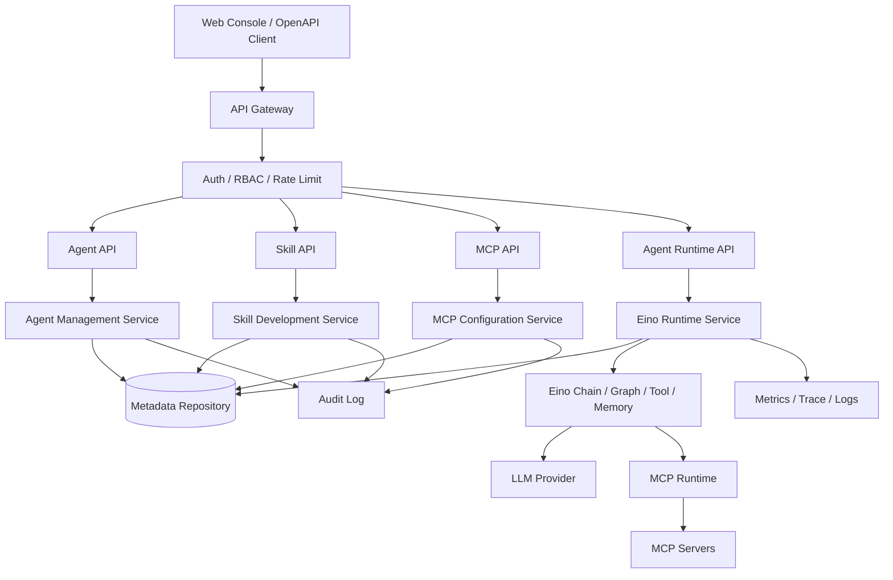

# 基于 Eino 的 Agent 助手系统技术方案

## 1. 建设目标

本系统面向企业内部 Agent 助手平台，支持 Agent 创建与管理、Skill 开发与集成、MCP 配置与部署。后端采用 Go 语言，以 Eino 作为 Agent 编排、Tool/Skill 调用、上下文管理与模型调用的核心框架。系统从 MVP 开始演进，先交付可运行、可验证、可扩展的最小闭环，再逐步接入真实 Eino Chain、Graph、Tool、Memory、Callback 与 MCP Runtime。

## 2. 阶段规划

### MVP 阶段

目标：完成平台核心元数据管理闭环。

范围：

1. Agent 创建、查询、列表。
2. Skill 注册、查询、列表。
3. MCP 配置创建、查询、列表。
4. Agent 绑定 Skill。
5. Agent 绑定 MCP 配置。
6. 提供 HTTP REST API。
7. 使用内存仓储，便于快速开发与测试。
8. 预留 Eino Runtime 接口，后续接入 Eino 编排执行。

不包含：

1. 真实模型调用。
2. 真实 MCP Server 拉起与健康巡检。
3. Skill 在线调试、发布审批、沙箱执行。
4. 多租户、RBAC、审计日志的完整实现。

### V1 阶段

1. 接入 PostgreSQL 或 MySQL 持久化。
2. 接入 Eino Tool、Chain、Graph，实现 Agent 运行接口。
3. Skill 支持版本、发布、回滚。
4. MCP 支持环境变量密文配置、部署状态、健康检查。
5. 接入 JWT/OAuth2 与 RBAC。
6. 增加审计日志、操作追踪、指标采集。

### V2 阶段

1. Agent 编排工作流可视化。
2. Skill Marketplace。
3. 多模型路由、成本控制、限流熔断。
4. 多租户隔离。
5. Kubernetes 部署 MCP Server。
6. 分布式 Trace、Prompt 观测与质量评估。

## 3. 总体架构



## 4. 模块划分

### 4.1 Agent 管理模块

职责：

1. 管理 Agent 基础信息：名称、描述、模型配置、系统提示词、状态。
2. 管理 Agent 与 Skill 的绑定关系。
3. 管理 Agent 与 MCP 配置的绑定关系。
4. 为 Runtime 提供 Agent 组装所需元数据。

MVP 数据模型：

| 字段 | 类型 | 说明 |
| --- | --- | --- |
| id | string | Agent ID |
| name | string | Agent 名称 |
| description | string | 描述 |
| model | string | 模型标识 |
| system_prompt | string | 系统提示词 |
| skill_ids | string[] | 绑定 Skill |
| mcp_config_ids | string[] | 绑定 MCP 配置 |
| status | string | active / disabled |
| created_at | datetime | 创建时间 |
| updated_at | datetime | 更新时间 |

关键能力：

1. 创建 Agent 时校验名称、模型、提示词长度。
2. 绑定 Skill 时校验 Skill 存在且状态可用。
3. 绑定 MCP 时校验 MCP 配置存在且状态可用。
4. 后续接入 Eino 时根据 Agent 元数据动态构造 Chain 或 Graph。

### 4.2 Skill 开发与集成模块

职责：

1. 管理 Skill 元数据：名称、描述、类型、入口、参数 Schema、状态。
2. 支持 HTTP Skill、Go 内置 Skill、MCP Tool Skill、Workflow Skill 等类型。
3. 后续支持 Skill 开发、测试、发布、版本管理。

Skill 类型建议：

| 类型 | 说明 |
| --- | --- |
| builtin | Go 内置实现，适合高频、低延迟能力 |
| http | 通过 HTTP Endpoint 调用第三方服务 |
| mcp_tool | 来自 MCP Server 的工具能力 |
| workflow | 由多个 Skill 或 Eino Graph 编排形成 |

MVP 数据模型：

| 字段 | 类型 | 说明 |
| --- | --- | --- |
| id | string | Skill ID |
| name | string | Skill 名称 |
| description | string | 描述 |
| type | string | builtin / http / mcp_tool / workflow |
| endpoint | string | HTTP 或 MCP 工具入口 |
| input_schema | json string | 输入参数 Schema |
| output_schema | json string | 输出参数 Schema |
| status | string | active / disabled |
| created_at | datetime | 创建时间 |
| updated_at | datetime | 更新时间 |

与 Eino 集成路径：

1. builtin Skill 映射为 Eino Tool。
2. http Skill 使用统一 HTTP Tool Adapter。
3. mcp_tool Skill 由 MCP Client 拉取工具清单后转换为 Eino Tool。
4. workflow Skill 使用 Eino Graph 表达多步骤执行流。

### 4.3 MCP 配置与部署模块

职责：

1. 管理 MCP Server 配置。
2. 支持 stdio、sse、streamable-http 等连接方式。
3. 管理命令、参数、环境变量、部署状态、健康检查。
4. 后续支持将 MCP Server 部署到 Kubernetes 或以 sidecar 方式运行。

MVP 数据模型：

| 字段 | 类型 | 说明 |
| --- | --- | --- |
| id | string | MCP 配置 ID |
| name | string | 配置名称 |
| transport | string | stdio / sse / streamable_http |
| command | string | stdio 模式命令 |
| args | string[] | 命令参数 |
| url | string | 远程 MCP Server 地址 |
| env | map | 环境变量，后续敏感字段加密 |
| status | string | active / disabled |
| created_at | datetime | 创建时间 |
| updated_at | datetime | 更新时间 |

安全要求：

1. env 中敏感字段不得明文返回。
2. stdio command 需进行白名单或审批控制。
3. 远程 URL 需限制 SSRF 风险，禁止访问内网敏感地址。
4. MCP Server 调用需加入超时、熔断、重试与审计。

## 5. 数据库设计

MVP 使用内存仓储。V1 建议使用 PostgreSQL，核心表如下。

```sql
CREATE TABLE agents (
    id VARCHAR(64) PRIMARY KEY,
    name VARCHAR(128) NOT NULL,
    description TEXT NOT NULL DEFAULT '',
    model VARCHAR(128) NOT NULL,
    system_prompt TEXT NOT NULL DEFAULT '',
    status VARCHAR(32) NOT NULL,
    created_at TIMESTAMPTZ NOT NULL,
    updated_at TIMESTAMPTZ NOT NULL
);

CREATE TABLE skills (
    id VARCHAR(64) PRIMARY KEY,
    name VARCHAR(128) NOT NULL,
    description TEXT NOT NULL DEFAULT '',
    type VARCHAR(32) NOT NULL,
    endpoint TEXT NOT NULL DEFAULT '',
    input_schema JSONB NOT NULL DEFAULT '{}'::jsonb,
    output_schema JSONB NOT NULL DEFAULT '{}'::jsonb,
    status VARCHAR(32) NOT NULL,
    created_at TIMESTAMPTZ NOT NULL,
    updated_at TIMESTAMPTZ NOT NULL
);

CREATE TABLE mcp_configs (
    id VARCHAR(64) PRIMARY KEY,
    name VARCHAR(128) NOT NULL,
    transport VARCHAR(32) NOT NULL,
    command TEXT NOT NULL DEFAULT '',
    args JSONB NOT NULL DEFAULT '[]'::jsonb,
    url TEXT NOT NULL DEFAULT '',
    env JSONB NOT NULL DEFAULT '{}'::jsonb,
    status VARCHAR(32) NOT NULL,
    created_at TIMESTAMPTZ NOT NULL,
    updated_at TIMESTAMPTZ NOT NULL
);

CREATE TABLE agent_skills (
    agent_id VARCHAR(64) NOT NULL REFERENCES agents(id),
    skill_id VARCHAR(64) NOT NULL REFERENCES skills(id),
    created_at TIMESTAMPTZ NOT NULL,
    PRIMARY KEY (agent_id, skill_id)
);

CREATE TABLE agent_mcp_configs (
    agent_id VARCHAR(64) NOT NULL REFERENCES agents(id),
    mcp_config_id VARCHAR(64) NOT NULL REFERENCES mcp_configs(id),
    created_at TIMESTAMPTZ NOT NULL,
    PRIMARY KEY (agent_id, mcp_config_id)
);

CREATE INDEX idx_agents_status ON agents(status);
CREATE INDEX idx_skills_type_status ON skills(type, status);
CREATE INDEX idx_mcp_configs_transport_status ON mcp_configs(transport, status);
```

## 6. API 接口规范

统一响应：

```json
{
  "data": {},
  "error": null
}
```

错误响应：

```json
{
  "data": null,
  "error": {
    "code": "invalid_request",
    "message": "name is required"
  }
}
```

### 6.1 Agent API

#### 创建 Agent

`POST /api/v1/agents`

请求：

```json
{
  "name": "data-assistant",
  "description": "数据分析助手",
  "model": "gpt-4o-mini",
  "system_prompt": "你是一个数据分析助手"
}
```

响应：`201 Created`

#### Agent 列表

`GET /api/v1/agents`

#### Agent 详情

`GET /api/v1/agents/{id}`

#### 绑定 Skill

`POST /api/v1/agents/{id}/skills/{skill_id}`

#### 绑定 MCP 配置

`POST /api/v1/agents/{id}/mcp-configs/{mcp_config_id}`

### 6.2 Skill API

#### 注册 Skill

`POST /api/v1/skills`

请求：

```json
{
  "name": "weather-query",
  "description": "天气查询",
  "type": "http",
  "endpoint": "https://example.com/weather",
  "input_schema": "{\"type\":\"object\"}",
  "output_schema": "{\"type\":\"object\"}"
}
```

#### Skill 列表

`GET /api/v1/skills`

#### Skill 详情

`GET /api/v1/skills/{id}`

### 6.3 MCP API

#### 创建 MCP 配置

`POST /api/v1/mcp-configs`

请求：

```json
{
  "name": "filesystem-mcp",
  "transport": "stdio",
  "command": "npx",
  "args": ["-y", "@modelcontextprotocol/server-filesystem", "/tmp"],
  "env": {}
}
```

#### MCP 配置列表

`GET /api/v1/mcp-configs`

#### MCP 配置详情

`GET /api/v1/mcp-configs/{id}`

## 7. 安全机制

MVP：

1. 请求体大小限制。
2. 输入字段校验。
3. 统一错误响应，避免泄露内部实现。
4. MCP env 返回时脱敏。
5. HTTP Server 设置读写超时。

V1：

1. JWT/OAuth2 鉴权。
2. RBAC 权限模型：platform_admin、agent_admin、skill_developer、viewer。
3. 操作审计日志。
4. Secret 使用 KMS 或 Vault 加密。
5. API 限流与租户级配额。
6. MCP 远程地址 SSRF 防护。

## 8. Eino 关键实现路径

### 8.1 Runtime 抽象

先定义 RuntimeService：

1. 从 AgentRepository 读取 Agent。
2. 读取绑定 Skills。
3. 读取绑定 MCP Configs。
4. 通过 SkillAdapter 转换成 Eino Tool。
5. 通过 MCPAdapter 连接 MCP Server 并转换为 Tool。
6. 使用 Eino Chain 或 Graph 执行 Agent。

### 8.2 Tool Adapter

1. BuiltinSkillAdapter：Go 函数转 Eino Tool。
2. HTTPSkillAdapter：HTTP API 转 Eino Tool。
3. MCPSkillAdapter：MCP Tool 清单转 Eino Tool。

### 8.3 Graph 编排

复杂 Agent 采用 Eino Graph：

1. Intent Node：识别意图。
2. Planning Node：生成步骤。
3. Tool Node：调用 Skill/MCP Tool。
4. Memory Node：读写上下文。
5. Answer Node：汇总输出。

## 9. 开发环境搭建

要求：

1. Go 1.22+。
2. Git。
3. 后续 V1 需要 Docker、PostgreSQL。

本地启动：

```bash
go mod tidy
go run ./cmd/server
```

健康检查：

```bash
curl http://localhost:8080/healthz
```

创建 Agent：

```bash
curl -X POST http://localhost:8080/api/v1/agents \
  -H 'Content-Type: application/json' \
  -d '{"name":"data-assistant","model":"gpt-4o-mini","system_prompt":"你是一个数据分析助手"}'
```

## 10. 测试策略

MVP：

1. Service 单元测试：校验创建、查询、绑定逻辑。
2. HTTP API 集成测试：校验路由、状态码、响应格式。
3. 安全测试：非法 JSON、缺失字段、未知 ID、敏感 env 脱敏。

V1：

1. Repository 集成测试：使用 Testcontainers 验证数据库读写。
2. Eino Runtime 测试：Mock LLM、Mock Tool、Mock MCP。
3. 压力测试：Agent 列表、运行接口、Skill 调用。
4. 契约测试：MCP Server 工具清单兼容性。

## 11. 部署方案

MVP：

1. 单进程 HTTP 服务。
2. 内存数据，重启丢失，仅用于开发验证。

V1：

1. Docker 镜像部署。
2. PostgreSQL 持久化。
3. Redis 缓存与限流。
4. Kubernetes Deployment + Service + Ingress。
5. ConfigMap 管理非敏感配置，Secret 管理密钥。
6. Prometheus + Grafana 采集指标。
7. OpenTelemetry 采集 Trace。

## 12. 开发协作规范

1. 新增业务能力先补 Service 测试，再实现 Handler。
2. API 变更需同步更新本文档。
3. 数据库变更需提供 migration。
4. 新增 Skill 类型必须实现统一 Adapter。
5. 所有外部调用必须设置超时、重试策略和熔断策略。
6. 不允许日志输出 Token、API Key、Secret、Cookie。
